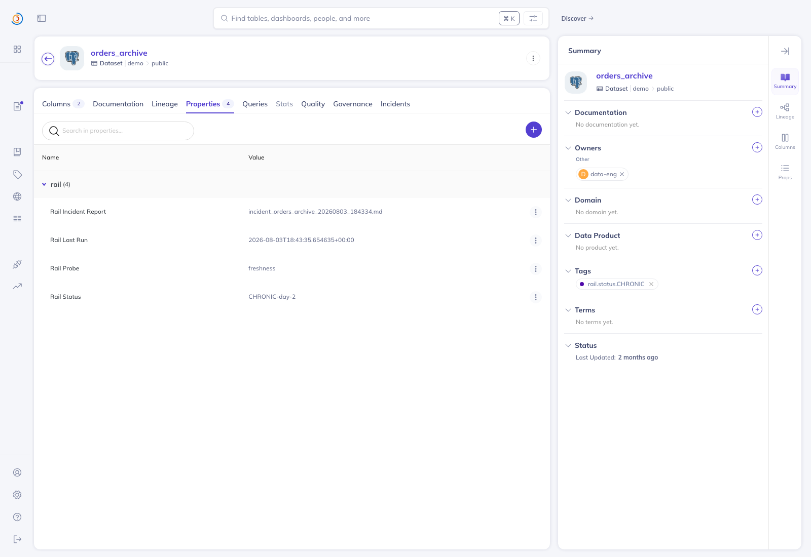

# datahub-rail-agent

A data-rail health monitor agent for DataHub's context graph. It runs capture-based liveness probes over dataset freshness, lineage, and schema contracts, applies fail-loud classification so silent outages surface as incidents instead of green dashboards, and produces delta-aware alerts that fire on meaningful change rather than raw thresholds. When something breaks, it walks the lineage graph to triage root cause and generates owner-addressed incident reports. It also detects schema and contract drift and emits PR-ready fix artifacts. Graph reads go through the DataHub MCP Server.

## Quick Start: From Zero to Demo

Every command below was run end to end against a local DataHub quickstart
(server v1.5.0.6, mcp-server-datahub v3.4.5) and the output shown is the
output it produced.

### Prerequisites

- Python 3.11 (3.14 is not supported: `pydantic-core` has no wheel for it)
- Docker Desktop, for the DataHub quickstart
- [`uv`](https://docs.astral.sh/uv/) on your PATH — the agent launches the
  MCP server with `uvx`

### 1. Clone and Install

```bash
git clone https://github.com/fivedollarfridays/datahub-rail-agent.git
cd datahub-rail-agent
python3.11 -m venv .venv
source .venv/bin/activate  # or .venv\Scripts\activate on Windows
pip install -e ".[dev]" -c constraints.txt
```

`constraints.txt` pins the toolchain the test suite and CI run against.

### 2. Start DataHub Locally

DataHub needs MySQL, Kafka and OpenSearch alongside GMS, so use the
quickstart rather than a bare `docker run`:

```bash
pip install acryl-datahub
datahub docker quickstart          # first run pulls images (15-30+ min)
```

Check it is up:

```bash
curl -s -o /dev/null -w '%{http_code}\n' http://localhost:8080/health   # 200
```

| Port | Service |
|---|---|
| 9002 | DataHub UI (login `datahub` / `datahub`) |
| 8080 | GMS: REST, `/api/graphql`, OpenAPI |

The quickstart runs with metadata-service auth disabled, so no access token
is needed locally.

### 3. The MCP Server

You do **not** need to start it yourself. The agent spawns
`uvx mcp-server-datahub@latest` over stdio and passes `DATAHUB_GMS_URL` /
`DATAHUB_GMS_TOKEN` through to it.

To verify the server independently:

```bash
DATAHUB_GMS_URL=http://localhost:8080 DATAHUB_GMS_TOKEN= \
  python scripts/mcp_smoke.py
```

See [docs/mcp-smoke.md](docs/mcp-smoke.md) for the recorded output.

### 4. Seed the Demo Estate

```bash
DATAHUB_GMS_URL=http://localhost:8080 python scripts/seed_demo_estate.py
```

Output:
```
✓ Seeded dataset: users (healthy control)
✓ Seeded dataset: orders_archive (stale: 45 days old)
✓ Seeded dataset: events (broken lineage: upstream soft-deleted)
✓ Seeded dataset: transactions (schema drift: int vs decimal(12,2))
✓ Seeded dataset: transactions_warehouse (downstream consumer)

Seeded 1 healthy control(s) and 3 fault class(es) into http://localhost:8080
```

Writes go through DataHub's OpenAPI v3 entity endpoint and are checked: any
non-2xx or error body raises `SeedError` rather than reporting a false
success. Re-running is idempotent — the same URNs are upserted, so the
estate stays at five datasets.

Search indexing is asynchronous; give it a few seconds before step 5.

### 5. Run Probes (First Pass)

```bash
python -m datahub_rail.agent \
  --config config/probes.yaml \
  --datahub-url http://localhost:8080
```

**Expected output:**
```
[FAIL] events — lineage_integrity: Broken lineage: declared upstream 'raw_events_old' missing from the graph
[FAIL] orders_archive — freshness: Dataset is stale: last modified 45 days ago (SLA: 24h)
[FAIL] transactions — schema_contract: Schema drift on 'amount': expected decimal(12,2), got int
[PASS] transactions_warehouse — freshness OK, lineage_integrity OK
[PASS] users — freshness OK, lineage_integrity OK
```

Three planted faults caught, two healthy controls pass. The digest that
follows classifies each failure on first sight:

```
NEW: urn:li:dataset:(...,demo.public.events,PROD) / lineage_integrity — Broken lineage: declared upstream 'raw_events_old' missing from the graph
NEW: urn:li:dataset:(...,demo.public.orders_archive,PROD) / freshness — Dataset is stale: last modified 45 days ago (SLA: 24h)
NEW: urn:li:dataset:(...,demo.public.transactions,PROD) / schema_contract — Schema drift on 'amount': expected decimal(12,2), got int
```

The process exits non-zero when any probe fails, so it drops straight into CI.

### 6. Check Incident Reports (Day 1)

```bash
ls outbox/
cat outbox/incident_orders_archive_*.md
```

Each report includes **What Broke** (dataset, owner @mentions), **Evidence**
(failing probe, message, last-modified date, lineage path), a
**Root-Cause Candidate**, **Next Steps**, and a **Provenance** table listing
every graph read the report is built from.

**Sample excerpt** (from `sample-outputs/incident_orders_archive.md`):
```markdown
### What Broke
Dataset: **orders_archive**
URN: `urn:li:dataset:(urn:li:dataPlatform:postgres,demo.public.orders_archive,PROD)`
Owner(s): @data-eng

### Evidence
- **Failing probe**: `freshness`
- **Probe**: Dataset is stale: last modified 45 days ago (SLA: 24h)
- **Last modified**: 2026-06-18 20:18 UTC (45 days old)

### Root-Cause Candidate
Dataset: **orders_archive** — is the failure
Platform: postgres
Distance from failure: 0 hops
Owner: @data-eng

### Provenance

| Fact source (tool) | Entity | Read at |
|---|---|---|
| `gms:datasetProperties.lastModified` | `urn:...demo.public.orders_archive,PROD)` | 2026-08-02T20:21:02.634620+00:00 |
| `gms:upstreamLineage` | `urn:...demo.public.orders_archive,PROD)` | 2026-08-02T20:21:02.646027+00:00 |
| `mcp:get_lineage` | `urn:...demo.public.orders_archive,PROD)` | 2026-08-02T20:21:02.892223+00:00 |
| `mcp:get_entities` | `urn:...demo.public.orders_archive,PROD)` | 2026-08-02T20:21:04.674104+00:00 |
```

(URNs abbreviated here for width; the committed report carries them in full.)

### 7. Run Probes Again (Day 2)

Run the exact same command a second time without fixing anything. The state
history is what makes the second run different — there is no clock to
advance and nothing to backdate:

```bash
python -m datahub_rail.agent \
  --config config/probes.yaml \
  --datahub-url http://localhost:8080
```

**Expected state digest:**
```
CHRONIC: urn:li:dataset:(...,demo.public.events,PROD) / lineage_integrity (day 2) — Broken lineage: declared upstream 'raw_events_old' missing from the graph
CHRONIC: urn:li:dataset:(...,demo.public.orders_archive,PROD) / freshness (day 2) — Dataset is stale: last modified 45 days ago (SLA: 24h)
CHRONIC: urn:li:dataset:(...,demo.public.transactions,PROD) / schema_contract (day 2) — Schema drift on 'amount': expected decimal(12,2), got int
```

The same faults are now "still failing (day 2)" instead of NEW. Fix a fault
and the next run reports `RECOVERED` for it. Delete `state_history.jsonl` to
reset the demo to day 1.

### 8. Check Fix Artifacts for Schema Drift

```bash
cat outbox/schema_patch_transactions_warehouse.yaml
cat outbox/schema_drift_transactions_warehouse.diff
cat outbox/commit_message_transactions_warehouse.txt
```

The diff is a real unified diff against the committed downstream contract at
[`contracts/transactions_warehouse.schema.yaml`](contracts/transactions_warehouse.schema.yaml),
so it applies as-is:

```bash
git apply --check outbox/schema_drift_transactions_warehouse.diff   # exits 0
```

- **Patch** — downstream config correction (YAML) for consumers to adopt the upstream type
- **Diff** — unified diff of the contract change, verified by `git apply` in the test suite
- **Commit message** — links fault class, detection method, and owner

### Verification: Screenshots & Outputs

1. **UI Verification:** open http://localhost:9002 (login `datahub`/`datahub`),
   search `orders_archive`, and check its last-modified metadata is 45 days old.
2. **Outbox Artifacts:** incident reports, patches and diffs all land in `outbox/`.
3. **State History:** run twice to see NEW flip to CHRONIC in `state_history.jsonl`.

`sample-outputs/` holds the artifacts from a real two-run pass against the
seeded estate, regenerated with `python scripts/refresh_sample_outputs.py`.

## Write-back: findings live in the graph

Everything above ends in a file on your disk. Write-back closes the loop and
puts the verdict back on the dataset itself, where the rest of the catalog can
see it. It is **opt-in** — add `--writeback`:

```bash
python -m datahub_rail.agent --writeback
```

Each probed dataset gets two markers, both visible on its DataHub page:

- a **`rail.status.*` tag** (`PASS` / `NEW-FAIL` / `CHRONIC` / `RECOVERED`) —
  a bounded, searchable set, so "show me everything chronically failing"
  becomes a catalog facet query rather than a log grep;
- four **structured properties** carrying the detail: the full delta-aware
  verdict (`CHRONIC-day-2`), the probe that judged it, the run timestamp, and
  the incident-report filename when one was written.



*`orders_archive` after two runs: the `rail.status.CHRONIC` tag in the sidebar,
and the `rail` property group showing `CHRONIC-day-2`, the `freshness` probe,
the run timestamp, and a pointer to `incident_orders_archive_*.md`.*

**Why this matters:** the agent stops being a tool you run and becomes context
other agents inherit. Any MCP-reading agent that already calls `get_entities`
or `search` now sees rail's health verdict on the assets it was going to touch
anyway — a query agent can refuse to answer off a `CHRONIC` table, and a
migration agent can see which upstreams are mid-incident, without either one
knowing this project exists.

Both aspects are read-merged before writing: rail replaces only its own
markers, so tags and properties set by humans or other tools survive, and a
`RECOVERED` dataset drops its stale incident pointer instead of stacking
markers forever. Repeat runs are idempotent. Write-back is fail-soft — if GMS
is unreachable the failure is logged loudly and the probe run still completes,
because the probe run is the product.

Verify it end-to-end against your quickstart:

```bash
python scripts/writeback_smoke.py
```

That runs the agent twice, reads the markers back out of GMS, and checks each
dataset carries exactly one rail tag and a readable verdict.

### Is the monitor itself still alive?

A monitor that dies quietly looks exactly like a healthy estate: no alerts,
no incidents, nothing to notice. `check-monitor` answers the question from
capture evidence — the `rail.last_run` stamps the agent wrote into the graph
— and never from a heartbeat file:

```bash
python -m datahub_rail.agent check-monitor --max-age-hours 24
```

Exit `0` when the newest write-back in the estate is inside the window:

```
[OK] Rail monitor is live: newest write-back 2026-08-03T19:56:16.154344+00:00 (0.0h ago, limit 24h) on urn:li:dataset:(urn:li:dataPlatform:postgres,demo.public.events,PROD)
```

Exit `1`, loudly, when it is not — naming the last run and the command that
restarts it:

```
[ALARM] MONITOR IS DEAD: newest write-back 2026-07-25T19:55:51.306437+00:00 (216.0h ago, limit 24h) on urn:li:dataset:(urn:li:dataPlatform:postgres,demo.public.events,PROD).
        Nothing has written a verdict into DataHub since then — the agent is not running, not that the estate is healthy.
        Re-run: python -m datahub_rail.agent --config config/probes.yaml --writeback
```

An estate with no rail markers at all also exits `1` — "no evidence" is a
blind state, not a passing one. Put the command in the same cron or CI job
that runs the agent, one entry later, and a dead rail becomes a red build
instead of a quiet week.

## Probes Engine

The health monitor runs three probe classes:

1. **FreshnessProbe** — Capture-based: measures dataset age from its own
   `lastModified` metadata and compares against a configurable SLA (default
   24h). Never queries job heartbeats.

2. **LineageProbe** — Compares *declared* upstream edges against the edges
   the graph can still *resolve*. A dataset that declares no upstream is a
   source table and passes; a dataset whose declared upstream no longer
   resolves (the target was deleted) fails loudly and names the missing
   dataset.

3. **SchemaProbe** — Compares actual field types against the expected
   downstream contract (e.g. `amount: decimal(12,2)`) and reports type drift.

**Never-raise contract:** all probes catch exceptions and return a
`ProbeResult` with `status: fail` and an actionable message. No silent passes
on unreachable states.

**Config-driven registry:** probes are loaded from `config/probes.yaml`, so
you can point the agent at your own estate by editing the config:

```yaml
probes:
  - name: freshness
    type: freshness
    params:
      sla_hours: 24
  - name: lineage_integrity
    type: lineage
    params: {}
  - name: schema_contract
    type: schema
    params:
      expected_fields:
        amount: decimal(12,2)

# Only these datasets have their schema contract enforced.
schema_contract_datasets:
  - urn:li:dataset:(urn:li:dataPlatform:postgres,demo.public.transactions,PROD)

discovery_query: demo.public
```

## Delta-Aware State History

**The Alarm-Fatigue Killer.** Threshold-based alerting fires on every
violation, drowning teams in noise when a single upstream SLA miss cascades
across a hundred datasets. This agent persists per-probe status history
(JSONL) and renders **delta-aware digests** — alerts keyed to *change*.

Each run classifies every probe as **NEW** (first occurrence), **CHRONIC**
(still failing on day N, deprioritized but tracked), or **RECOVERED**
(fail→pass, closes the incident). A first run with no history degrades
gracefully.

## Lineage-Walk Triage

When a probe fails the agent walks the lineage graph upstream to identify the
**root-cause candidate** — the deepest failing node in the chain. It then:

1. **Collects upstream nodes** — BFS walk up to a configurable depth
2. **Picks root cause** — deepest node, deterministic tie-break by URN; a
   dataset with no upstream is reported as its own root cause at 0 hops
3. **Gathers evidence** — freshness timestamps, lineage path, probe messages
4. **Generates an owner-addressed markdown report** with @mentions

**Provenance guarantee:** every fact in a report comes from a DataHub graph
read, and each report ends with a provenance table naming the tool, entity
and timestamp of every read behind it. Nothing in the evidence is generated
text.

### Producer healthy, delivery broken

A stale dataset whose immediate upstreams are all *fresh* is a different
fault from a stale dataset behind a stalled pipeline: the producer ran, the
output never arrived, and the break sits on the edge between them. When the
graph shows that shape the report leads with an explicit callout, both
capture timestamps side by side, before the root-cause candidate it
corrects:

```markdown
### Producer Healthy, Delivery Broken
**ops.db.schedule_events** is 16h old against a 6h SLA, but every immediate upstream is inside SLA. The producer ran; the output did not arrive.

| Node | Role | Last capture (graph) |
|---|---|---|
| `ops.db.schedule_events` | failing output | 2026-08-03 04:14 UTC (0 days old) — 16h old |
| `ops.db.interactions` | immediate upstream | 2026-08-03 16:38 UTC (0 days old) — 3h old |

The newest upstream moved 12h more recently than this output changed. The break is on the edge between them — a missing config file, an unmet prerequisite, or an expired credential — not the scheduler and not the producing job, whose run history will read green throughout.
```

If any immediate upstream is stale too, no callout is emitted: there the
upstream really is a suspect and the ordinary root-cause walk stands. The
extra freshness reads only happen for a dataset already past SLA, so runs
without the fault make exactly the graph calls they made before.

## How DataHub Is Read

Graph reads go through the DataHub MCP Server (v3.4.5), using the tools it
actually exposes:

| Need | Source |
|---|---|
| Dataset discovery | MCP `search` |
| Owner, name, platform | MCP `get_entities` |
| Schema field types | MCP `list_schema_fields` |
| Resolved upstream lineage | MCP `get_lineage` |
| `lastModified` freshness | GMS `datasetProperties` aspect |
| Declared lineage edges | GMS `upstreamLineage` aspect |

The last two are read from the same DataHub instance over OpenAPI v3 because
the MCP tool surface does not expose them: entity properties come back
without `lastModified`, and `get_lineage` only returns upstreams that still
resolve — a soft-deleted upstream simply disappears, which is precisely the
fault the lineage probe needs to see.

## Demo Data Estate

`scripts/seed_demo_estate.py` plants a deterministic estate with three
deliberate faults plus healthy controls.

### Fault Classes (3)

1. **Stale Freshness** — `orders_archive` with a `lastModified` 45 days old.
2. **Broken Lineage Edge** — `events` declares an upstream edge to
   `raw_events_old`, which is then soft-deleted, leaving the edge dangling.
3. **Schema-Contract Drift** — `transactions.amount` is `int` while the
   downstream consumer `transactions_warehouse` still expects `decimal(12,2)`.

### Healthy Controls

- **users** — current freshness, no declared upstream, no contract violation.
- **transactions_warehouse** — current freshness with intact lineage.

## Development

```bash
pip install -e ".[dev]" -c constraints.txt
python -m pytest tests/ -q     # 220 tests, network-blocked
ruff check src/ tests/         # ruff 0.16.1
```

## Upstream Contribution

**Bonus criterion:** a health-monitoring agent patterns guide contributed to
the DataHub MCP Server project — [PR #174](https://github.com/acryldata/mcp-server-datahub/pull/174)
(`docs/agent-patterns-health-monitoring.md`), documenting capture-based
freshness probes, the never-raise error contract, delta-aware alerting,
lineage-walk triage, and provenance guarantees.

## Hackathon entry

Built for **Build with DataHub: The Agent Hackathon** (Devpost).

## Prior inspiration disclosure

The design applies a capture-reliability doctrine battle-tested in a private
ops system (capture-based liveness, fail-loud on outage, freshness verified
before reporting state). All code in this repository is newly written during
the submission period.

## Failure modes from our own estate

Every row below is a fault that actually ran in our production ops system,
and the behaviour this agent has because of it. None of them were caught by
a threshold or a dashboard; each one was invisible until something downstream
was already lost.

| Failure mode | What happened | What the agent does about it |
|---|---|---|
| Silent capture outage | An ingest feed captured nothing for 24 days behind a green heartbeat. The job started on schedule, exited zero and wrote no rows, so every status surface read healthy while the data stopped. | Freshness is capture-based: each probe measures a dataset's own `lastModified` and never a job's exit status. A feed that runs and writes nothing fails the probe on the next pass. |
| Producer green, deliverable dead | A daily deliverable stopped arriving for nine days while the pipeline producing it ran green every night. The operator watched the producer, saw healthy runs, and spent a week diagnosing the scheduler; the break was a missing config file on the delivery step. | Triage compares the failing dataset's capture time against its immediate upstreams'. Stale output behind fresh producers gets the "Producer Healthy, Delivery Broken" callout, both timestamps shown, pointing at the edge instead of the job. |
| Silently dead watcher | A scheduled watcher stopped producing check runs entirely and nothing said so. An absence of output is indistinguishable from a quiet week, so the monitor's own death was the one failure the monitor could not report. | `check-monitor` exits non-zero when the newest `rail.last_run` stamp in the graph is older than a given window, or when there is no stamp at all. Liveness is judged from what the agent actually wrote, so a dead rail is one command away from a red build. |
| Fail-soft handler hiding a broken test | A test asserted that a write-back happened, but the code under test opened a connection first inside a fail-soft `try`. On a developer machine with DataHub running that connect succeeded and the test passed; in CI, with nothing listening, the swallowed exception skipped the assertion and the test failed. | The suite blocks sockets for every test, with an explicit `allow_network` marker as the only escape hatch. A canary test asserts the block is live — including a real `aiohttp` call to the quickstart URL — so a guard that quietly stopped working cannot pass as a green suite. |

## Doctrine & Inspiration

1. **Capture-based liveness** — measure freshness from the data's own
   timestamps, not job heartbeats. Jobs succeed silently while data stales.
2. **Fail-loud on outage** — never-raise contracts turn exceptions into
   actionable messages; writes that fail raise instead of reporting success.
3. **Delta-aware alerting** — fire on state *change* (NEW / CHRONIC /
   RECOVERED), not raw thresholds.
4. **Lineage-walk root-cause triage** — walk the DAG to the deepest failing
   node so blame does not land on innocent consumers.
5. **Provenance guarantee** — every fact in a report is traceable to a
   specific graph read.

## License

Apache-2.0
